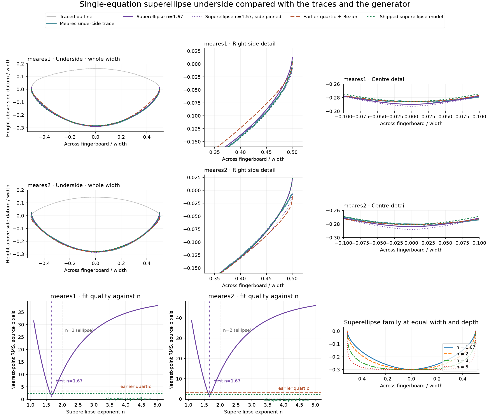

# Meares cross-section tracing and analysis

Both scans support a shallow playing surface, a deeper underside, and rounded transitions at the sides. A **closed periodic cubic B-spline** captures all three regions without imposing sharp intersections or a constant side radius. The central playing surface is nevertheless close to circular: the strongest reason to replace the two-arc model is the side blends, rather than evidence of a radically different central crown.


## Measurements

Dimensions below are divided by each drawing's traced width, **W**. They are image measurements, not physical dimensions or claims about the original maker's construction method.

| Measurement | meares1 | meares2 |
| --- | ---: | ---: |
| Traced width, source pixels | 623 | 758 |
| Maximum thickness / W | 0.448 | 0.426 |
| Playing-surface rise above side datum / W | 0.162 | 0.145 |
| Underside depth below side datum / W | 0.287 | 0.282 |
| Approximate crown radius / W, circle fit to central 60% | 1.171 | 1.156 |
| Approximate underside radius / W, circle fit to central 60% | 0.573 | 0.569 |

The crown radii are finite-window estimates, **not exact local curvature measurements**. The side datum is the average height of the two rounded width extrema after alignment. Rise and depth therefore depend somewhat on how the extremities are traced. Maximum thickness is the largest top-to-bottom separation at a common horizontal coordinate; it is not simply the sum of independently located extrema.

At equal width, meares1 is about 5% thicker than meares2. Their middle-region radii are similar. Their blends differ more visibly: meares1 rolls over more broadly, especially on the left in the normalized view; meares2 has tighter transitions. Both have some left/right differences. The scans alone cannot establish whether these differences are intentional, hand-drawing variation, or reproduction effects.


## Where circles succeed and fail

The following RMS distances are radial distances to independently fitted circles, using only the middle 80% of the width. Circle centers and radii were all free to move; the fits were not forced to meet at the sides.

| Surface | meares1 RMS, pixels | meares2 RMS, pixels |
| --- | ---: | ---: |
| Playing surface | 0.63 | 0.62 |
| Underside | 0.90 | 1.32 |

These small errors mean a circle is a reasonable description of much of the central region at this drawing resolution. Fits over different spans give different radii, especially for meares2's top and both undersides; see `measurements.json` for the 60%, 80%, and 96% fits. This suggests variable curvature but does not establish a unique analytic curve family from these scans.

The dashed circles in the following figure are the same middle-80% fits, extrapolated towards the edges. They visibly miss the top roll-over and do not join into the observed closed outline. A separate side blend is essential. A single ellipse or a different conic would still impose a shape assumption; we have not established either as the maker's intended geometry.


## Trace representation and design parameters

The exported periodic cubic B-splines provide a practical reference shape. Their position, first derivative, and second derivative match at closure, so the regular curves have continuous tangents and curvature through the sides. They preserve the observed asymmetry. This smoothness is a modeling choice, not a claim that the ink specifies an exact curvature law.

The [client-side generator](../site/README.md) provides **width W, playing-surface radius R, maximum thickness T, and corner drop D**. The playing surface is a fixed circular curve. The latest construction retains a short vertical side, carves a quartic underside up into it with a G2 quintic transition, then rounds the top corner with a small tangent circular fillet. Changing D leaves the whole underside unchanged. The nominal flat-side height of `0.1 T` is an assumption awaiting confirmation.


The Meares 1 preset now lowers the top corners with a 4 mm rounding radius (about 2.59 mm corner drop); its accepted underside is unchanged. Meares 2 retains 0.5 mm rounding. These comparisons use an assumed 60 mm width, aligned by crown and equal width. The app exposes a Corner drop control to set the vertical lowering directly. These are symmetric interpretations, not exact reproductions of the drawings. [The original-scan overlay](latest-source-overlay.png) shows the same model in source coordinates. Run `python scripts/compare_latest_profiles.py` after tracing to reproduce both figures from the current JavaScript generator; this also requires Node.js.

The generator is a symmetric design family inspired by these references, not a deformation of the traced splines. The trace files remain measured reference shapes. The four dimensions still do not uniquely specify every possible outline: the underside's quartic proportions and the blend construction are explicit modeling choices, documented with the generator.

## A single-equation alternative: the superellipse

The generator's underside is a quartic in `x` over the central 76% of the width, with a
quintic Bezier carrying it up into the flat sides. A curve written as `y = f(x)` has finite
slope everywhere, so no polynomial can meet a vertical side tangentially; the second piece
exists for that reason. A **superellipse** `(x/a)^n + (y/b)^n = 1` does reach `x = a` with a
vertical tangent for any `n > 1`, so it can describe the underside and its side roll-over in
one equation.

Fitting `n`, `b` and the maximum-width height to the traced undersides, with `a` pinned to the
traced half width, gives `n` near **1.67** for both drawings, and fits them better than the
current construction:

| Nearest-point RMS, source pixels | meares1 | meares2 |
| --- | ---: | ---: |
| Superellipse, maximum-width height free | 1.69 | 1.90 |
| Superellipse, height pinned to the traced side datum | 2.10 | 3.00 |
| Generator quartic + Bezier + flat side | 3.37 | 3.08 |

The gain is almost entirely at the sides. Over the central 60% the two are comparable (1.40 vs
1.52 on meares1; 2.10 vs 2.36 on meares2); outside it the superellipse is roughly twice as
close (2.03 vs 4.93; 1.55 vs 3.89). This is consistent with the circle-fit results above: the
central region is not where the models disagree.



Three caveats before treating that free-fit `n = 1.67` as a result:

1. The best fit puts the curve's maximum-width height **above** the traced widest point, by
   1.26 mm (meares1) and 1.84 mm (meares2) at an assumed 60 mm width, so the trace stops short
   of the vertical tangent. Pinning that height to the traced side datum is the honest
   single-equation constraint and costs accuracy, dropping `n` to 1.57 and 1.52. On meares2 the
   pinned fit is no better than the current construction.
2. `n < 2` makes the second derivative unbounded at `x = 0`: curvature grows without limit at
   the centreline instead of settling. It is small in physical terms — the radius is about
   34 mm at 3 mm from the centre against the generator's 33 mm, tightening to roughly 20 mm at
   0.6 mm and 9 mm at 0.06 mm — but the surface is not C2 there, unlike the present quartic.
3. Both models are symmetric and both traces are not, so each pays the same asymmetry penalty.
   These are in-sample fits to two drawings, not evidence of a construction rule.

### What survives when it becomes a generator

The generator's default underside **is now this superellipse**; the quartic remains reachable
as `model: 'quartic'`. One equation and one exponent replace three curve pieces and six chosen
constants, and the Bernstein convexity machinery goes with them, since a superellipse is convex
for every `n > 1`.

The decisive correction came from how the board is actually made. A rectangular blank is
radiused on top; the underside is then worked down until it rises to meet the blank's original
flat face; whatever flat is left is softened last with a file. So the flat side is **leftover
stock**, not a design proportion, and it only has to outlast the corner drop. Sizing it that
way instead of fixing it at `0.1 T` changes the result:

| Nearest-point RMS, source pixels | meares1 | meares2 |
| --- | ---: | ---: |
| Superellipse, flat side sized to the corner drop, `n` 1.69 | **2.40** | **2.31** |
| Quartic + Bezier + `0.1 T` flat side | 3.37 | 3.08 |

Both drawings improve, and the gain is largest at the sides (4.93 to 2.89; 3.89 to 1.63) where
the quartic needed its carving piece. A fixed `0.1 T` wall was forcing meares2 to carry 2.56 mm
of flat it never wanted; sized to its 0.32 mm corner drop it needs 0.42 mm. The presets record
that: meares1 keeps `sideFraction` 0.1 for its 2.59 mm drop, meares2 uses 0.0164.

The vertical meeting is the point. A curve written `y = f(x)` has finite slope everywhere, so
no polynomial can arrive at the blank's vertical face; the quartic needed a separate blending
Bezier purely to get there. The superellipse arrives vertically on its own, which is also what
the wood does.

Two costs are real and recorded in the tests. For `n < 2` curvature is unbounded at the centre
*and* at the wall, where the quintic Bezier used to arrive at zero curvature (G2); the
superellipse holds a vertical tangent there (G1) but its curvature diverges. Both singularities
sit within a micron of the extremes, well below what a gouge, scraper or file resolves in wood.
And `n` is a fitted dial, not a derived quantity: it ranges 1.52 to 1.84 depending on how the
flat side is pinned, and the two drawings only agree closely once each is given its own wall.

Reproduce with `.venv/bin/python scripts/fit_superellipse.py`; results are written to
`superellipse-fit.json`.

## Method and accuracy

1. Crop around each cross section, excluding the neighbouring longitudinal drawing. Interpret the left-hand outer surface in each original scan as the playing surface, consistent with its gentler curvature.
2. Threshold dark ink at grayscale 128. Use the outermost ink envelope, including the outer line where the source has a double outline. Hatching and the internal material boundary are not treated as surface contours.
3. Estimate orientation from the construction line, then refine it with three rigid rotations using the midpoints of the two rounded extremities. Use translation and uniform scaling; no shear or perspective correction is applied. Normalized left corresponds to the lower end of the original scan.
4. Sample the two envelope branches in one-pixel-wide bins. Interpolate a 19-pixel-wide gap around the crossing construction line, about 3.0% of W in meares1 and 2.5% in meares2. The trace CSV marks interpolated samples with `observed_not_interpolated = 0`. Apply a three-sample median filter to reduce raster spikes. Even observed samples are filtered measurements of the ink envelope.
5. Join the branches around the extremities, resample uniformly by perimeter distance, and fit a periodic cubic spline with a 0.9-source-pixel smoothing target. The short end closures are also reconstructed between the sampled envelope branches.
6. Export the fitted contour and compare it with the extracted envelope. Verify closure through the second derivative, finite coordinates, noncrossing envelope branches, and consistently signed curvature at 6,001 spline samples.

The fitted curves have RMS nearest-sampled-curve distances of **0.65 px** (meares1) and **0.64 px** (meares2) to the extracted envelope. Maximum distances are **2.51 px** and **5.13 px**, respectively; the tighter meares2 side is less faithfully retained by the smooth model. These are in-sample approximation errors, not independent validation or absolute measurement accuracy. Convexity was checked densely, not proved analytically.

Ink thickness, doubled outlines, endpoint selection and possible scan distortion limit accuracy. The envelope is the outside of the ink rather than an inferred stroke centre, so it can slightly overestimate width and thickness. Subpixel fit statistics should not be interpreted as subpixel knowledge of the original object. No physical scale, exact side radius, or manufacturing tolerance can be recovered from these images alone.

## Files and reproduction

- `meares1-trace.csv`, `meares2-trace.csv`: sampled top and underside, normalized by source width; includes interpolation flags.
- `meares1-contour.csv`, `meares2-contour.csv`: 1,201 ordered points around each fitted closed outline, including the repeated endpoint.
- `meares1-outline.svg`, `meares2-outline.svg`: sampled vector outlines. SVG coordinates use 1,000 units per source width; they are not millimetres. Smoothing may move the extrema slightly.
- `meares1-spline.json`, `meares2-spline.json`: exact cubic spline knots and control coefficients, plus the source-coordinate transformation. Evaluate with SciPy `splev(t, (knots, np.array(coefficients).T, degree))`, for `0 <= t <= 1`.
- `superellipse-comparison.png`, `superellipse-comparison.svg`, `superellipse-fit.json`: single-equation superellipse fits to the traced undersides, compared with the generator.
- `measurements.json`: full numeric measurements and circle/spline fit diagnostics.
- PNG and SVG comparison figures: source overlays, normalized comparison, and side enlargements.

To regenerate from the unmodified source PNGs:

```sh
python3 -m venv .venv
.venv/bin/pip install -r analysis/requirements.txt
.venv/bin/python scripts/analyse_profiles.py
```

The script contains explicit source-specific crops and alignment estimates. It is reproducible tracing for these two drawings, not a general image-segmentation tool.
